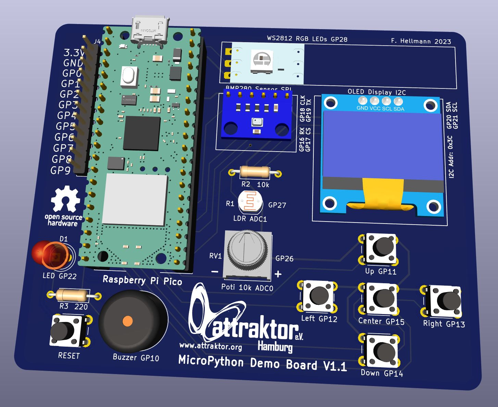
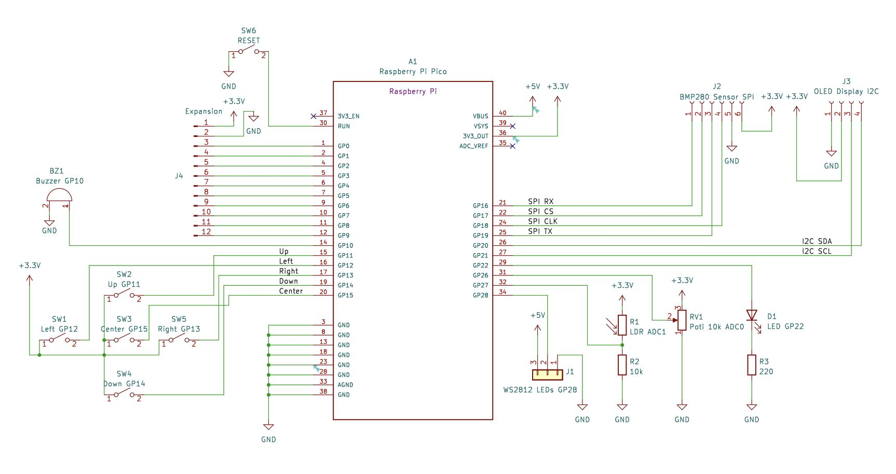
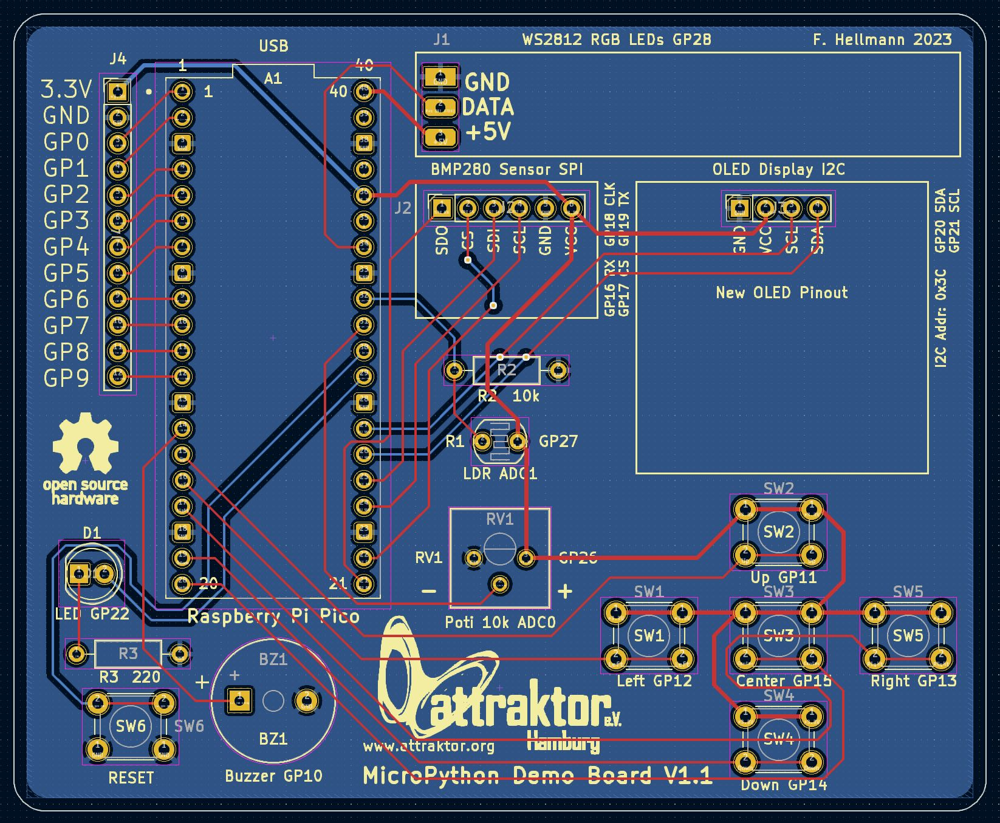

# MicroPython DemoBoard

### What is the MicroPython DemoBoard?
This started out as a little PCB that we could use in our MicroPython Workshops. We quickly found out during the workshops that 
breadboarding sensors, buttons and other components took a lot of extra time, was prone to error and sometimes frustrating for beginners.
So I decided to create a PCB with some standard components that a Raspberry Pi Pico could be plugged into. No mess of wires anymore.

There is two areas that the workshops cover:

1. Building the hardware itself. Good for beginners and people that already know programming, but have no or little expirience with real hardware
2. Learning to program hardware with MicroPython on the hardware itself. 

This repo contains all necessary files for our MicroPython Hardware Workshop at the Attraktor e.V. Makerspace in Hamburg, Germany: 
<a href="https://wiki.attraktor.org/Micropython_Kurs_2023"> Attraktor MicroPython Workshop </a>

### Documentation:
I have provided extensive documentation about the build process, how to program with MicroPython and included a lot of examples.
You can find the documentation in the Docs directory:

English <a href="./Docs/MicroPython_Demoboard_V1.1_EN.pdf"> MicroPython Demoboard EN Doc (pdf) </a>

German  <a href="./Docs/MicroPython_Demoboard_V1.1_DE.pdf"> MicroPython Demoboard DE Doc (pdf) </a>

### Hardware:
The demoboard works with a Raspberry Pi Pico WH plugged into the pinheaders and connects it to various sensors, buttons, LEDs and an OLED display.

Gerber files to get your own boards produced can be found under the releases tab on the right and in the hardware directory.

You can find an interactive BOM (Bill of Material) here: <a href="https://raw.githack.com/sandman72/micropython_demoboard/main/Hardware/KiCAD_DemoBoard_V1.1/MicroPython_DemoBoard_V1.1_iBOM.html" traget="_blank"> iBOM </a>

BEWARE: Due to the infamous Errata E7 bug I recommend to stick to the Rasperry Pi Pico RP2040 boards and not use the new Pi Pico 2 RP2350 based ones as the buttons will not work correctly.

### Firmware:
Included in the firmware directory is a board test file and the invaders game as self contained UF2 files.

Simply enter the bootsel mode (hold down the bootsel button, while plugging the Pi Pico in) and copy one for the firmwares over.

### Software:
The software folder contains some demo scripts to try out the different sensors, buttons, buzzer, LEDs and display.

Included are some games like space invaders, flappy bird, snake and pong as well.

Also you'll find the test scripts there.
